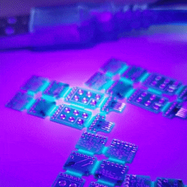
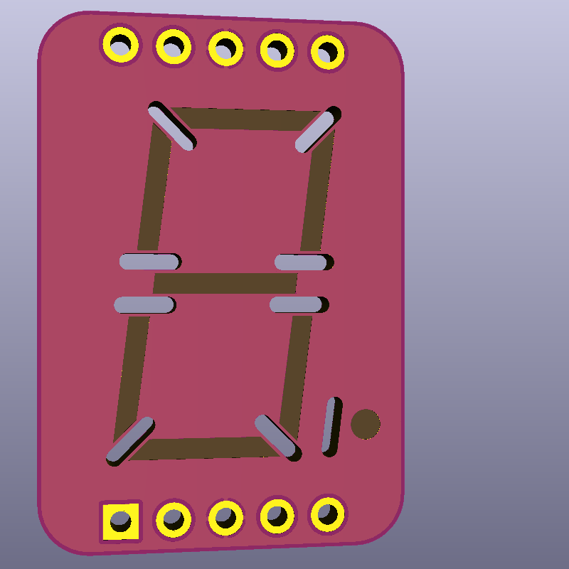
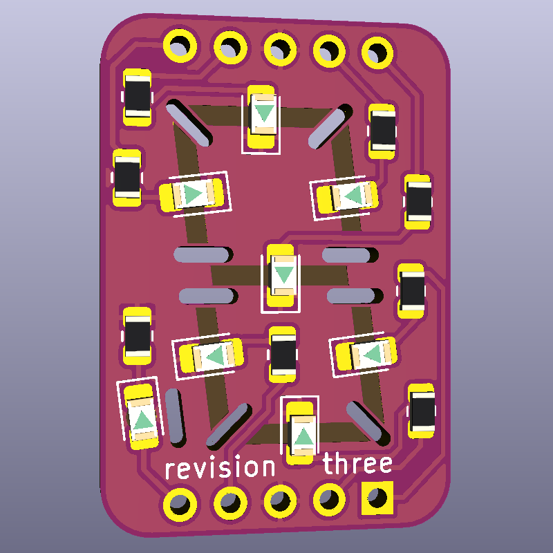
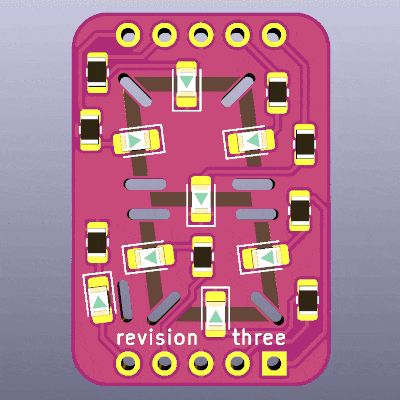
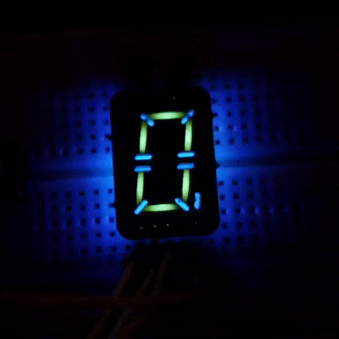
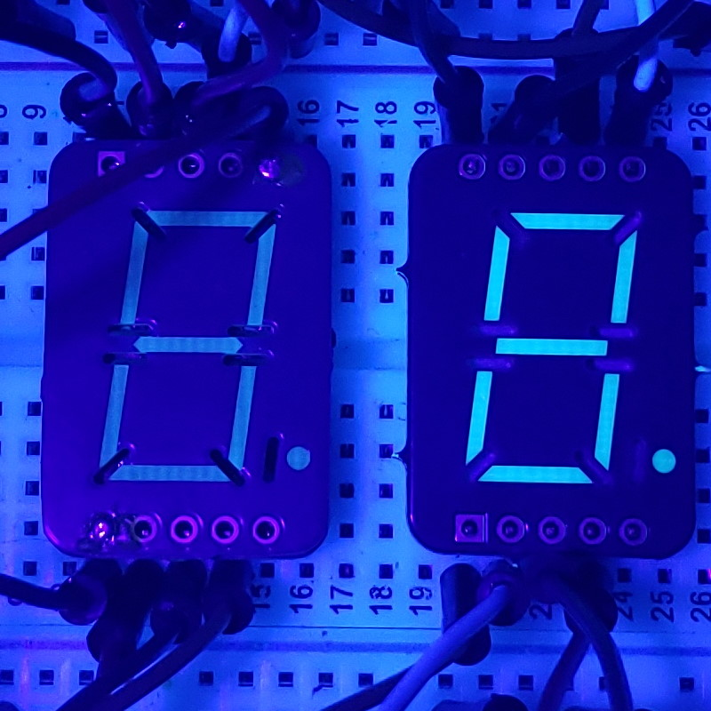
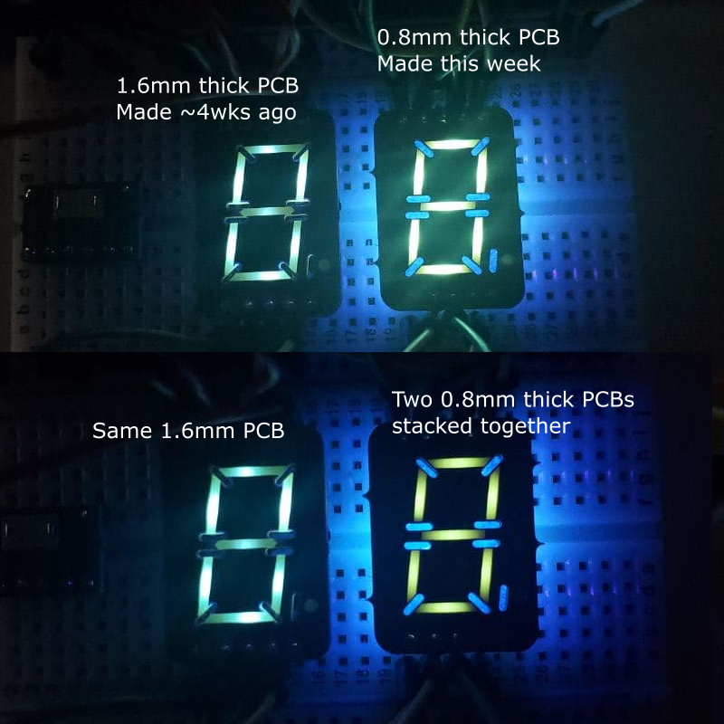

# FR-4 Fluorescence Demo and 7-Segment Display PCB

## Intro

If you've ever played with a blacklight (or watched certain police procedurals), you've probably noticed that lots of materials fluoresce under a blacklight. However, one material I did *not* expect to fluoresce was FR-4, the common core material for PCBs. It emits a blue-green that you don't see in LEDs, it's more like old VFDs or strontium aluminate. You'll only see it on areas without soldermask, like the lines in-between boards on these panels:

So what's going on here? I have been making (and talking about) PCBs for over a decade, and I had never heard of this happening until I noticed it for myself! Is this common knowledge? Do people know about this and just don't care?

Well, if it's not common knowledge yet, I'd like to at least spread it around. Maybe someday, someone will remember this little fact and incorporate it into a beautiful work of art.

## The demo board

To demonstrate the phenomenon more clearly, I put together a 7-segment display PCB. The segments have had soldermask removed on both sides, and an 0805 UV LED is soldered upside-down under each segment. The pinout matches that of [common 7-segment modules](https://www.sparkfun.com/products/8546), but the rows of pins are 0.1 inches farther apart on mine, and external resistors are not needed on mine.

The plated slots between the segments stop light from bleeding through to neighboring segments. I haven't experimented much with them, maybe they can be shorter. They do need to be plated, though; if the walls of the slot are exposed, they will fluoresce! Defeating the entire point of the slots.

For this demo, the display is being driven by an Arduino. Each segment draws about 15 mA which the digital ports can handle just fine.

If you wanted to, you could put any color LEDs on this board. I don't see why 

## Questions

After going through all this, I think I'm left with more questions than I started with! For one thing, why is the color so different on different PCBs? Let's compare the segments' colors on the Revision 2 PCB (1.6mm thick, made about a month ago) and the Revision 3 PCB (0.8mm thick, made this week).

In the picture above, you see that Rev 3 is so much brighter than Rev 2 when illuminated from above. Why? I don't think Rev 2 was this faint when I received it, but maybe it was?

In the picture above, both boards are lit from below. The Rev 2 board lights up quite well now! And it has the color I anticipated from the previous observations. The Rev 3 board has a much greener tint to it and I don't know why! Rev 3 is also brighter, which isn't too suprising since it's only 0.8mm thick. But when I dropped a second 0.8mm board on top of it, the resulting segments are even greener! It's more of a radium wristwatch color.

## Molecule talk

My unscientific hunch was that the fluorescence comes from bisphenol-A compounds used in the FR-4 epoxy to sandwich layers of fiberglass together. I *think* I read that BPA fluoresces. But what color? Do the other bisphenol analogues fluoresce?

The only PCB substrates that I *haven't* seen fluoresce are OSH Park's After Dark core (which is dyed black) and old boards that I think are FR-1 or FR-2. They might be G-10, I'm not sure how to check. But those also use BPA in their epoxy formulations, don't they? Like I said, I have more questions than when I started.